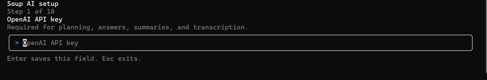

# Soup AI

`Soup AI` is a local-only Telegram supervisor for Windows. It polls a private Telegram bot, stores state in SQLite, uses OpenAI to decide whether to answer directly or run local work, and hands repo or machine tasks to `codex exec` inside one approved workspace root.

## What it does

- Polls Telegram updates on each run and inserts inbound messages into SQLite
- Accepts plain text, voice notes, and audio attachments
- Transcribes audio locally through the OpenAI transcription API before processing
- Uses an execution planner to choose `answer_directly` or `run_codex`
- Answers direct questions through the OpenAI Agents SDK, with hosted web search available for current topics
- Runs local work through `codex exec` and stores task records plus tool-run details
- Summarizes older chat context into compact session memory
- Retries outbound Telegram delivery on later runs if sending fails
- Uses a lease so overlapping scheduler runs do not process the queue at the same time
- Recovers abandoned running jobs/tasks if a prior run died mid-execution

## Requirements

- Windows with Task Scheduler
- Node.js `25+`
- `codex` on `PATH`
- Telegram bot token
- OpenAI API key

## Setup

```powershell
npm install
npm run setup
npm run supervisor:once
npm run task:register
```

`npm run setup` opens an interactive terminal setup wizard, writes `.env`, and initializes the SQLite DB. In non-interactive environments it falls back to the prompt-based setup flow. The setup process collects:



- `OPENAI_API_KEY`
- `TELEGRAM_BOT_TOKEN`
- `TELEGRAM_ALLOWED_CHAT_IDS`
- `SUPERVISOR_WORKSPACE_ROOT`
- `OPENAI_MODEL`
- `OPENAI_MEMORY_MODEL`
- `OPENAI_TRANSCRIPTION_MODEL`
- `SUPERVISOR_DB_PATH`
- `CODEX_BIN`
- `CODEX_ENABLE_SEARCH`

See [docs/telegram.md](./docs/telegram.md) for the bot token and chat ID workflow.

## Useful commands

```powershell
npm run discover:telegram
npm run inspect:codex
npm run send:message -- --text "Manual outbound test"
npm run supervisor:once
npm run task:register
npm run task:unregister
npm test
```

## Telegram commands

- `/help`
- `/health`
- `/status`
- `/tasks`

Anything else is treated as a supervisor request. Soup AI either replies directly or starts a Codex task and posts a follow-up summary when it finishes.

## Configuration

- `.env.example` shows the supported environment variables
- `SUPERVISOR_WORKSPACE_ROOT` is the hard boundary for local Codex work
- `SUPERVISOR_DB_PATH` defaults to `./data/soup-ai.sqlite`
- `OPENAI_MODEL` is used for planning, direct replies, and Codex result summaries
- `OPENAI_MEMORY_MODEL` is used by the session summarizer and falls back to `OPENAI_MODEL`
- `OPENAI_TRANSCRIPTION_MODEL` is used for Telegram audio transcription
- `CODEX_MODEL` is optional; if Codex rejects it, the runner retries without an explicit model
- `CODEX_ENABLE_SEARCH=true` enables Codex web search during local runs
- `CODEX_TIMEOUT_MS` defaults to `900000`
- `CODEX_MAX_OUTPUT_CHARS` caps the result text stored back into task summaries
- `TELEGRAM_ALLOWED_CHAT_IDS` should contain only private chat IDs you trust
- `.env` is local and gitignored

## Security

Codex runs with `--dangerously-bypass-approvals-and-sandbox`. In practice, this bot can execute local work as your user account inside the configured workspace root. Treat the Telegram bot as privileged local access.
