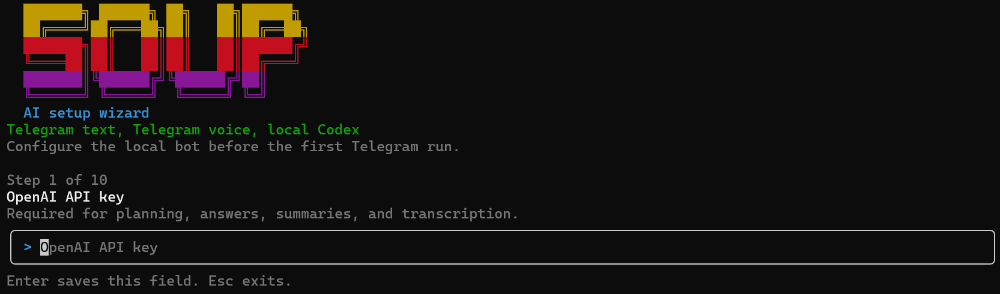

# Soup AI

`Soup AI` is a local-only Telegram supervisor for Windows. It polls a private Telegram bot, stores state in SQLite, uses OpenAI to decide whether to answer directly or run local repo work through `codex exec` inside one approved workspace.

## Setup

Requirements:

- Windows with Task Scheduler
- Node.js `25+`
- `codex` on `PATH`
- Telegram bot token
- OpenAI API key

Install and initialize:

```powershell
npm install
npm run setup
```

`npm run setup` writes `.env`, initializes SQLite, and collects the core settings:



- `OPENAI_API_KEY`
- `TELEGRAM_BOT_TOKEN`
- `TELEGRAM_ALLOWED_CHAT_IDS`
- `SUPERVISOR_WORKSPACE_ROOT`
- `OPENAI_MODEL`
- `OPENAI_MEMORY_MODEL`
- `OPENAI_TRANSCRIPTION_MODEL`
- `SUPERVISOR_DB_PATH`
- `CODEX_BIN`
- `CODEX_ENABLE_SEARCH`

See [docs/telegram.md](./docs/telegram.md) for bot token and chat ID setup.

After setup, send the bot a message or voice note from an allowed chat, then run:

```powershell
npm run supervisor:once
```

That single run polls Telegram, downloads and transcribes supported audio, processes requests, and sends queued replies.

For normal use, run the persistent supervisor:

```powershell
npm run supervisor:serve
```

That keeps a local process alive, long-polls Telegram, and handles new messages with lower latency. If it works, register the Windows scheduled task:

```powershell
npm run task:register
```

## How It Works

Soup AI can:

- accept text, voice notes, and audio attachments
- answer direct questions through OpenAI
- queue local Codex work and send results back to Telegram when it finishes
- summarize older chat context into compact session memory
- retry outbound Telegram sends and recover abandoned work after a crash

In `supervisor:serve`, Codex work is backgrounded by default:

- Soup AI acknowledges the request immediately
- it queues a tracked SQLite task
- one Codex task runs at a time
- direct replies, `/status`, and message ingestion continue while Codex runs

Requests that explicitly ask to use Codex are routed to execution. Informational requests can still be answered directly.

## Useful Commands

```powershell
npm run discover:telegram
npm run inspect:codex
npm run send:message -- --text "Manual outbound test"
npm run supervisor:once
npm run supervisor:serve
npm run task:register
npm run task:stop
npm run task:unregister
npm test
```

## Telegram Commands

- `/help` shows the built-in command list.
- `/health` is an alias for `/status`.
- `/status` shows the current supervisor snapshot.
  It includes pending/running jobs, pending outbound messages, queued/running tasks, active Codex telemetry, and the current conversation state for the chat.
- `/tasks` shows the five most recent tracked tasks with status, progress, checklist state when present, and result summary.
- `/memory` shows the current conversation memory summary, durable facts, durable profile, and recent notes.
- `/reset` archives the current conversation, starts a fresh one, and preserves curated memory for reseeding.

Anything else is treated as a supervisor request. Soup AI either replies directly or starts a Codex task and posts a follow-up summary when it finishes.

Example `/status` reply:

```text
Soup AI health
pendingJobs: 0
runningJobs: 0
pendingOutbound: 0
queuedTasks: 1
runningTasks: 1
activeCodexTaskId: 77
activeCodexPid: 4321
activeCodexTitle: Inspect repo state
activeCodexStartedAt: 2026-04-02T22:42:13.746Z
activeCodexTimeoutAt: 2026-04-02T22:57:13.746Z
conversationGeneration: 0
activeConversationId: conv_1
lastResetAt: (never)
lastResetReason: (none)
```

## Configuration

- `.env.example` lists supported environment variables.
- `SUPERVISOR_WORKSPACE_ROOT` is the hard boundary for local Codex work.
- `SUPERVISOR_DB_PATH` defaults to `./data/soup-ai.sqlite`.
- `SUPERVISOR_ENABLE_BACKGROUND_CODEX_TASKS=true` enables background queuing; `supervisor:serve` forces this on automatically.
- `OPENAI_MODEL` is used for planning, direct replies, and Codex result summaries.
- `OPENAI_MEMORY_MODEL` falls back to `OPENAI_MODEL`.
- `OPENAI_TRANSCRIPTION_MODEL` is used for Telegram audio transcription.
- `CODEX_MODEL` is optional; if Codex rejects it, the runner retries without an explicit model.
- `CODEX_ENABLE_SEARCH=true` enables Codex web search during local runs.
- `CODEX_TIMEOUT_MS` defaults to `900000`.
- `.env` is local and gitignored.

## Security

Codex runs with `--dangerously-bypass-approvals-and-sandbox`. Treat the Telegram bot as privileged local access within the configured workspace root.
